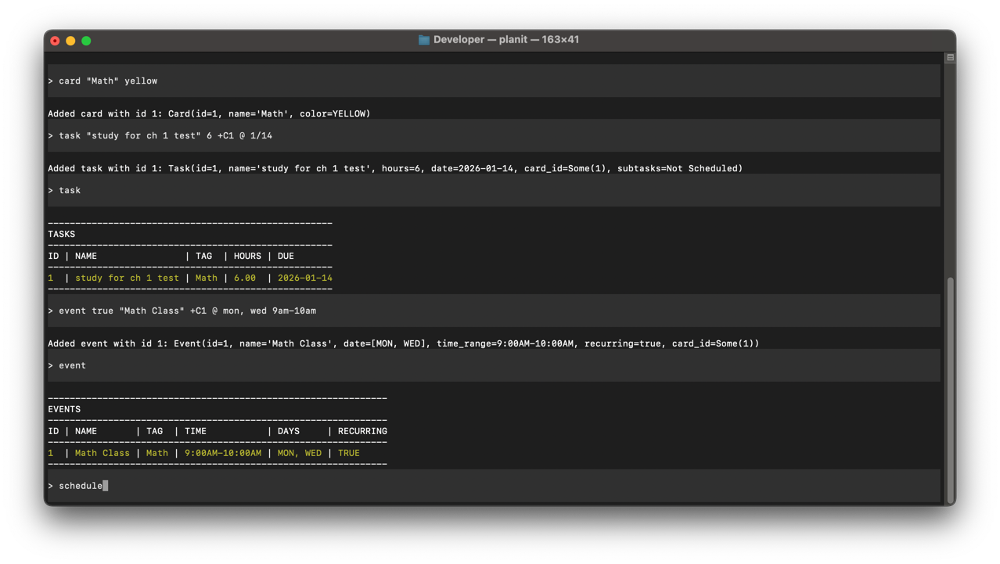

[](https://github.com/khalidh223/planit/actions/workflows/ci.yml)

Planit is a robust, dynamic scheduling CLI tool for generating timetabled daily/weekly schedules. 



Features include:

- Adding, modifying, deleting tasks, cards, and events
- Customizable, dynamic scheduling preferences closely integrated with config
- Export & import of saved entities
- Intelligent timetabling with clean start/end times
- Intelligent argument parser that allows flexible argument entry, time & day expressions
- Bespoke log tooling

Ambitious features coming soon-ish (and whatever else I can think of):

- Export to (and maybe import from) many popular third party calendar services
- Distributed, [Git](https://git-scm.com/)-like version control system
- UI editor
- Even more customizability via config
- Even more commands

## Setup

Requirements:
- Rust toolchain (stable). Install via [rustup](https://rustup.rs/).

Clone and build:
```sh
cd planit
cargo build
```

Run the CLI:
```sh
cargo run
```

Optionally override paths at startup:
```sh
cargo run -- --config /path/to/config.json --schedules /path/to/schedules --logs /path/to/logs
```

Run tests:
```sh
cargo test
```

## Usage

Get started by running `planit`. 

Below, we will explain the responsibility of each of the entities involved:

### Tasks

Activities that have an estimated number of hours & are due by a particular day.

They can be broken up into **subtasks**, unlike Events.

```
Usage:
  # Displays created tasks
  task
  # Adds a task
  task "<name>" <hours> [cardId] @ <date>
  # Modifies a task
  mod task <id> "<name>" <hours> [cardId] @ <date>
  # Deletes a task
  del task <id>

Notes:
  - Use '@' to signal the start of a time expression. It must be on its own, followed by the date.

Required:
  - name    Name for the created Task (whitespace only is not permitted, quotes required).
  - hours   Number of hours for a given Task.
  - date    Due date so the scheduling platform can assign it appropriate days. Run 'date' command to see valid formats.
Optional:
  - cardId  Id referencing a Card for its tag and color. Must prefix with '+C'.  
```

### Cards

Cards serve as labels & colors for Tasks and Events. This helps with logically grouping data together.

```
Usage:
  # Displays created cards
  card
  # Adds a card
  card "<name>" <color>
  # Modifies a card
  mod card <id> "<name>" <color>
  # Deletes a card
  del card <id>
Required:
  - name    Name for created Card (whitespace only is not permitted, quotes required).
  - color   Color for Card. Run 'colors' command to see valid colors.
```

### Events
Events serve the role of time-blocks, both recurring and individual. Events are best compared to classes and meetings. Events cannot be broken up.

```
Usage:
  # Displays created events
  event
  # Adds an event
  event <bool> <name> [cardId] @ <date> <timestamp>
  # Modifies an event
  mod event <id> <bool> <name> [cardId] @ <date> <timestamp>
  # Deletes an event
  del event <id>
  
Required:
  - bool        Whether the event is recurring
  - name        Name for created Event (whitespace only is not permitted, quotes required).
  - timestamp   Timestamp for the Event that represents the start/end time for the day. Run 'time' command to see valid formats for start/end.

Optional:
  - date        Comma separated days on which the Event is to be assigned, defaults to every day if not provided.
  - cardId      Id referencing a Card for its tag and color. Must prefix with '+C'.
```

### Scheduling
Schedule your tasks & events by running the `schedule` command. How and when tasks end up being split into subtasks, if at all, is determined by your config.
After scheduling successfully, a table of events & split tasks is displayed for the following week.

### Logging

System events are logged to files in either the location provided at startup, or the default location (if allowed via config). 

Run the `log` command to see the logs for the current session. 

### Config
User configurations is what drives the dynamic nature, and customizability, of planit.

Running `config` will open an alternative screen to edit the `config.json` at either the path specified at startup, or at the default location. 

If there are any missing keys, or values are in an unexpected format, the program will refuse it at startup; validation is also performed on edit.

## Reference Manual

Planit ships with a built-in manual. Use the `man` command to view documentation in the CLI.

```sh
# General manual
man

# Command-specific pages
man task
man event
man card
man config
man schedule
man log
man save
man read

# Type helpers
man date
man time
man colors
```

Manual pages include:
- Usage patterns for add/modify/delete (where applicable)
- Required vs optional arguments
- Short descriptions and related commands

## Contributing

We welcome contributions from anyone who is interested in improving Planit and
expanding its features. Before you start, please read `CONTRIBUTING.md`.

## License

MIT. See `LICENSE`.
